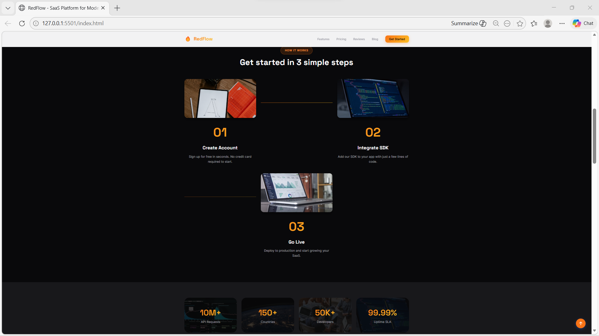
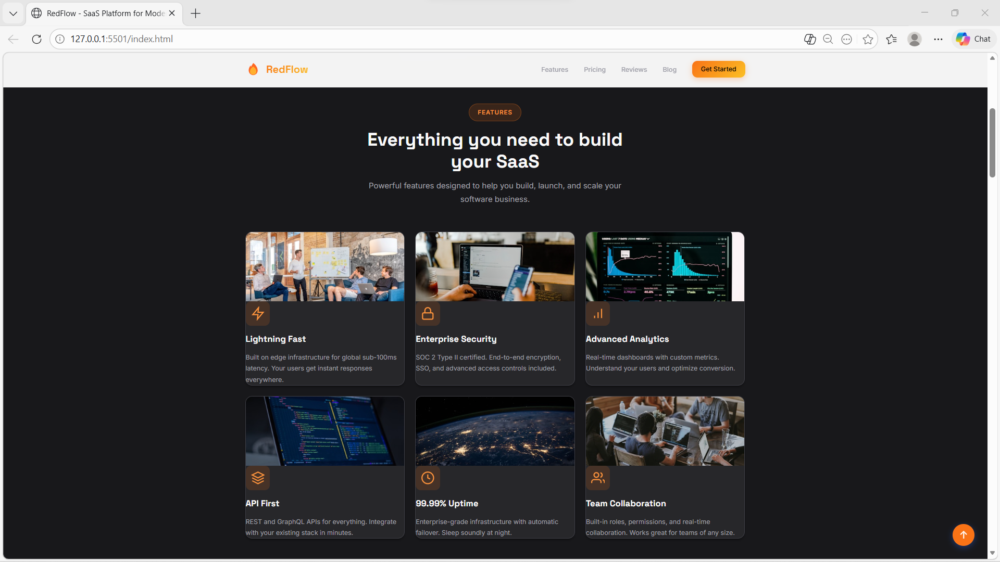
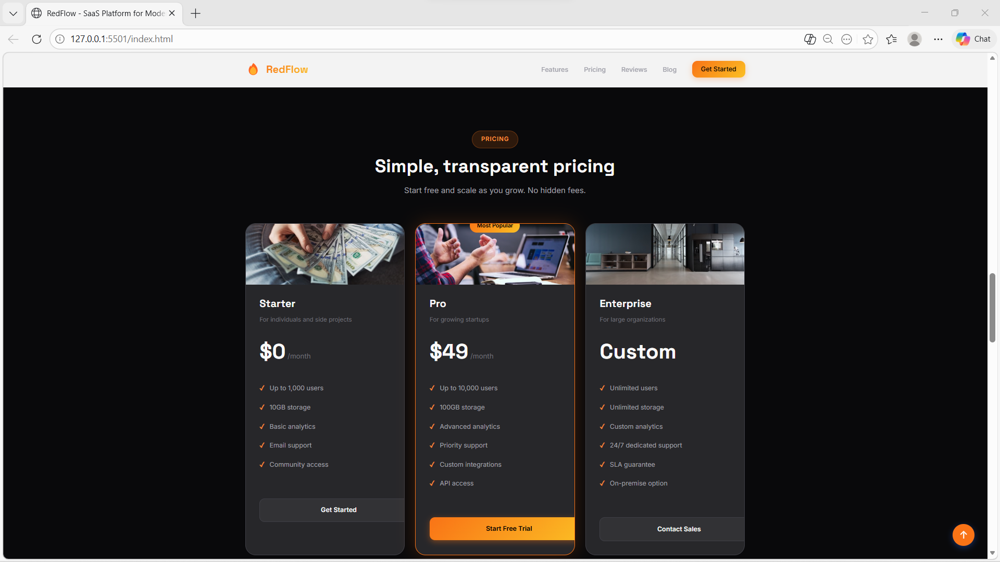
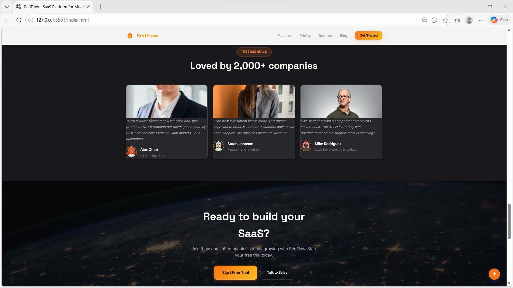
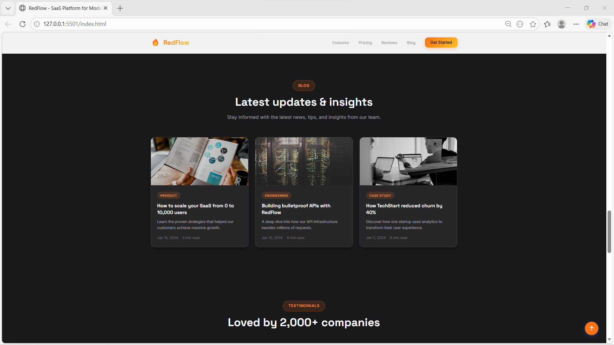

# 🔥 RedFlow | Premium SaaS Landing Page Template

🔗 **Live Demo:** https://redflow-portfolio.netlify.app




> 💡 **Note:** The source code is publicly available in this repository.

RedFlow is a Premium SaaS landing page template with dark theme, vibrant orange accents, and 9 conversion-optimized sections. Perfect for startups. Fully responsive, modern design, easy to customize.

## Author

**Manpreet Kaur** - Freelance Web Developer

## Features

- **Premium Dark Theme** - Sophisticated design that builds trust
- **9 Professional Sections** - Hero, Features, How It Works, Stats, Pricing, Blog, Testimonials, CTA, Contact
- **Fully Responsive** - Looks great on mobile, tablet, and desktop
- **Conversion Optimized** - Layout designed to maximize leads
- **Easy to Customize** - Clean code, simple to modify
- **No Build Required** - Opens directly in browser

## Images Used

### Hero Section
- Main Dashboard: `https://images.unsplash.com/photo-1460925895917-afdab827c52f?w=600&h=400&fit=crop`

### Features Section
- Lightning Fast: `https://images.unsplash.com/photo-1557804506-669a67965ba0?w=400&h=250&fit=crop`
- Enterprise Security: `https://images.unsplash.com/photo-1563986768609-322da13575f3?w=400&h=250&fit=crop`
- Advanced Analytics: `https://images.unsplash.com/photo-1551288049-bebda4e38f71?w=400&h=250&fit=crop`
- API First: `https://images.unsplash.com/photo-1555066931-4365d14bab8c?w=400&h=250&fit=crop`
- 99.99% Uptime: `https://images.unsplash.com/photo-1451187580459-43490279c0fa?w=400&h=250&fit=crop`
- Team Collaboration: `https://images.unsplash.com/photo-1522071820081-009f0129c71c?w=400&h=250&fit=crop`

### How It Works
- Create Account: `https://images.unsplash.com/photo-1611532736597-de2d4265fba3?w=400&h=300&fit=crop`
- Integrate SDK: `https://images.unsplash.com/photo-1555066931-4365d14bab8c?w=400&h=300&fit=crop`
- Go Live: `https://images.unsplash.com/photo-1460925895917-afdab827c52f?w=400&h=300&fit=crop`

### Stats Section
- API Requests: `https://images.unsplash.com/photo-1551288049-bebda4e38f71?w=200&h=200&fit=crop`
- Countries: `https://images.unsplash.com/photo-1451187580459-43490279c0fa?w=200&h=200&fit=crop`
- Developers: `https://images.unsplash.com/photo-1522071820081-009f0129c71c?w=200&h=200&fit=crop`
- Uptime SLA: `https://images.unsplash.com/photo-1555066931-4365d14bab8c?w=200&h=200&fit=crop`

### Pricing Section
- Starter: `https://images.unsplash.com/photo-1553729459-efe14ef6055d?w=400&h=200&fit=crop`
- Pro: `https://images.unsplash.com/photo-1517245386807-bb43f82c33c4?w=400&h=200&fit=crop`
- Enterprise: `https://images.unsplash.com/photo-1497366216548-37526070297c?w=400&h=200&fit=crop`

### Blog Section
- Scaling SaaS: `https://images.unsplash.com/photo-1553484771-371a605b060b?w=400&h=250&fit=crop`
- Building APIs: `https://images.unsplash.com/photo-1558494949-ef010cbdcc31?w=400&h=250&fit=crop`
- Case Study: `https://images.unsplash.com/photo-1553877522-43269d4ea984?w=400&h=250&fit=crop`

### Testimonials Section
- Alex (CTO): `https://images.unsplash.com/photo-1560250097-0b93528c311a?w=400&h=250&fit=crop`
- Sarah (Founder): `https://images.unsplash.com/photo-1573496359142-b8d87734a5a2?w=400&h=250&fit=crop`
- Mike (Developer): `https://images.unsplash.com/photo-1472099645785-5658abf4ff4e?w=400&h=250&fit=crop`

### CTA Section
- Background: `https://images.unsplash.com/photo-1451187580459-43490279c0fa?w=1200&h=600&fit=crop`

### Contact Section
- Contact: `https://images.unsplash.com/photo-1522071820081-009f0129c71c?w=500&h=400&fit=crop`

## Tech Stack

- **HTML5** - Structure
- **CSS3** - Styling
- **JavaScript (ES6)** - Interactivity
- **Responsive Design** - Mobile-friendly
- **Netlify Deployment** - Easy hosting


## Quick Start

1. Clone the repository
2. Open `index.html` in your browser
3. Customize the text and images
4. Deploy to Netlify, Vercel, or any hosting

## Environment Variables (For Netlify Deployment)

To keep sensitive data like API keys, database passwords, and secret tokens secure, use Netlify's environment variables. **Sensitive data is NEVER exposed in frontend code** - variables are injected at build time only.

### Adding Environment Variables in Netlify:

1. Select your site
2. Go to **Site settings** → **Environment variables**
3. Click **Add variable** and add your key-value pairs

Example variables to add:
- `API_KEY` - Your API key
- `DATABASE_URL` - Database connection string
- `SECRET_TOKEN` - Secret token for authentication
- `API_ENDPOINT` - API endpoint URL

### How It Works:

1. The source code contains placeholder values like `'REPLACE_API_KEY'`
2. During Netlify build, `build-env.js` script replaces these placeholders with actual environment variable values
3. The deployed site contains the actual values, but they are NEVER visible in source code repositories

### Usage in Code:

```javascript
// Access environment variable
const apiKey = CONFIG.API_KEY;
const dbUrl = CONFIG.DATABASE_URL;
const token = CONFIG.SECRET_TOKEN;
```

## Files

- `index.html` - Main HTML structure
- `styles.css` - All styling
- `script.js` - Interactive functionality

## License

MIT License - Free to use for personal and commercial projects.

---

Made with ❤️ for SaaS founders

- Integrate SDK: `https://images.unsplash.com/photo-1555066931-4365d14bab8c?w=400&h=300&fit=crop`
- Go Live: `https://images.unsplash.com/photo-1460925895917-afdab827c52f?w=400&h=300&fit=crop`

### Stats Section
- API Requests: `https://images.unsplash.com/photo-1551288049-bebda4e38f71?w=200&h=200&fit=crop`
- Countries: `https://images.unsplash.com/photo-1451187580459-43490279c0fa?w=200&h=200&fit=crop`
- Developers: `https://images.unsplash.com/photo-1522071820081-009f0129c71c?w=200&h=200&fit=crop`
- Uptime SLA: `https://images.unsplash.com/photo-1555066931-4365d14bab8c?w=200&h=200&fit=crop`

### Pricing Section
- Starter: `https://images.unsplash.com/photo-1553729459-efe14ef6055d?w=400&h=200&fit=crop`
- Pro: `https://images.unsplash.com/photo-1517245386807-bb43f82c33c4?w=400&h=200&fit=crop`
- Enterprise: `https://images.unsplash.com/photo-1497366216548-37526070297c?w=400&h=200&fit=crop`

### Blog Section
- Scaling SaaS: `https://images.unsplash.com/photo-1553484771-371a605b060b?w=400&h=250&fit=crop`
- Building APIs: `https://images.unsplash.com/photo-1558494949-ef010cbdcc31?w=400&h=250&fit=crop`
- Case Study: `https://images.unsplash.com/photo-1553877522-43269d4ea984?w=400&h=250&fit=crop`

### Testimonials Section
- Alex (CTO): `https://images.unsplash.com/photo-1560250097-0b93528c311a?w=400&h=250&fit=crop`
- Sarah (Founder): `https://images.unsplash.com/photo-1573496359142-b8d87734a5a2?w=400&h=250&fit=crop`
- Mike (Developer): `https://images.unsplash.com/photo-1472099645785-5658abf4ff4e?w=400&h=250&fit=crop`

### CTA Section
- Background: `https://images.unsplash.com/photo-1451187580459-43490279c0fa?w=1200&h=600&fit=crop`

### Contact Section
- Contact: `https://images.unsplash.com/photo-1522071820081-009f0129c71c?w=500&h=400&fit=crop`

## Tech Stack

- **HTML5** - Structure
- **CSS3** - Styling
- **JavaScript (ES6)** - Interactivity
- **Responsive Design** - Mobile-friendly
- **Netlify Deployment** - Easy hosting

## Screenshots

### Project Preview


### Features


### Pricing


### Reviews


### Get Started


### Blogs


## Quick Start

1. Clone the repository
2. Open `index.html` in your browser
3. Customize the text and images
4. Deploy to Netlify, Vercel, or any hosting

## Environment Variables (For Netlify Deployment)

To keep sensitive data like API keys, database passwords, and secret tokens secure, use Netlify's environment variables. **Sensitive data is NEVER exposed in frontend code** - variables are injected at build time only.

### Adding Environment Variables in Netlify:

1. Select your site
2. Go to **Site settings** → **Environment variables**
3. Click **Add variable** and add your key-value pairs

Example variables to add:
- `API_KEY` - Your API key
- `DATABASE_URL` - Database connection string
- `SECRET_TOKEN` - Secret token for authentication
- `API_ENDPOINT` - API endpoint URL

### How It Works:

1. The source code contains placeholder values like `'REPLACE_API_KEY'`
2. During Netlify build, `build-env.js` script replaces these placeholders with actual environment variable values
3. The deployed site contains the actual values, but they are NEVER visible in source code repositories

### Usage in Code:

```javascript
// Access environment variable
const apiKey = CONFIG.API_KEY;
const dbUrl = CONFIG.DATABASE_URL;
const token = CONFIG.SECRET_TOKEN;
```

## Files

- `index.html` - Main HTML structure
- `styles.css` - All styling
- `script.js` - Interactive functionality

## License

MIT License - Free to use for personal and commercial projects.

---

Made with ❤️ for SaaS founders


### How It Works
- Create Account: `https://images.unsplash.com/photo-1611532736597-de2d4265fba3?w=400&h=300&fit=crop`
- Integrate SDK: `https://images.unsplash.com/photo-1555066931-4365d14bab8c?w=400&h=300&fit=crop`
- Go Live: `https://images.unsplash.com/photo-1460925895917-afdab827c52f?w=400&h=300&fit=crop`

### Stats Section
- API Requests: `https://images.unsplash.com/photo-1551288049-bebda4e38f71?w=200&h=200&fit=crop`
- Countries: `https://images.unsplash.com/photo-1451187580459-43490279c0fa?w=200&h=200&fit=crop`
- Developers: `https://images.unsplash.com/photo-1522071820081-009f0129c71c?w=200&h=200&fit=crop`
- Uptime SLA: `https://images.unsplash.com/photo-1555066931-4365d14bab8c?w=200&h=200&fit=crop`

### Pricing Section
- Starter: `https://images.unsplash.com/photo-1553729459-efe14ef6055d?w=400&h=200&fit=crop`
- Pro: `https://images.unsplash.com/photo-1517245386807-bb43f82c33c4?w=400&h=200&fit=crop`
- Enterprise: `https://images.unsplash.com/photo-1497366216548-37526070297c?w=400&h=200&fit=crop`

### Blog Section
- Scaling SaaS: `https://images.unsplash.com/photo-1553484771-371a605b060b?w=400&h=250&fit=crop`
- Building APIs: `https://images.unsplash.com/photo-1558494949-ef010cbdcc31?w=400&h=250&fit=crop`
- Case Study: `https://images.unsplash.com/photo-1553877522-43269d4ea984?w=400&h=250&fit=crop`

### Testimonials Section
- Alex (CTO): `https://images.unsplash.com/photo-1560250097-0b93528c311a?w=400&h=250&fit=crop`
- Sarah (Founder): `https://images.unsplash.com/photo-1573496359142-b8d87734a5a2?w=400&h=250&fit=crop`
- Mike (Developer): `https://images.unsplash.com/photo-1472099645785-5658abf4ff4e?w=400&h=250&fit=crop`

### CTA Section
- Background: `https://images.unsplash.com/photo-1451187580459-43490279c0fa?w=1200&h=600&fit=crop`

### Contact Section
- Contact: `https://images.unsplash.com/photo-1522071820081-009f0129c71c?w=500&h=400&fit=crop`

## Tech Stack

- **HTML5** - Structure
- **CSS3** - Styling
- **JavaScript (ES6)** - Interactivity
- **Responsive Design** - Mobile-friendly
- **Netlify Deployment** - Easy hosting


## Quick Start

1. Clone the repository
2. Open `index.html` in your browser
3. Customize the text and images
4. Deploy to Netlify, Vercel, or any hosting

## Environment Variables (For Netlify Deployment)

To keep sensitive data like API keys, database passwords, and secret tokens secure, use Netlify's environment variables. **Sensitive data is NEVER exposed in frontend code** - variables are injected at build time only.

### Adding Environment Variables in Netlify:

1. Select your site
2. Go to **Site settings** → **Environment variables**
3. Click **Add variable** and add your key-value pairs

Example variables to add:
- `API_KEY` - Your API key
- `DATABASE_URL` - Database connection string
- `SECRET_TOKEN` - Secret token for authentication
- `API_ENDPOINT` - API endpoint URL

### How It Works:

1. The source code contains placeholder values like `'REPLACE_API_KEY'`
2. During Netlify build, `build-env.js` script replaces these placeholders with actual environment variable values
3. The deployed site contains the actual values, but they are NEVER visible in source code repositories

### Usage in Code:

```javascript
// Access environment variable
const apiKey = CONFIG.API_KEY;
const dbUrl = CONFIG.DATABASE_URL;
const token = CONFIG.SECRET_TOKEN;
```

## Files

- `index.html` - Main HTML structure
- `styles.css` - All styling
- `script.js` - Interactive functionality

## License

MIT License - Free to use for personal and commercial projects.

---

Made with ❤️ for SaaS founders

